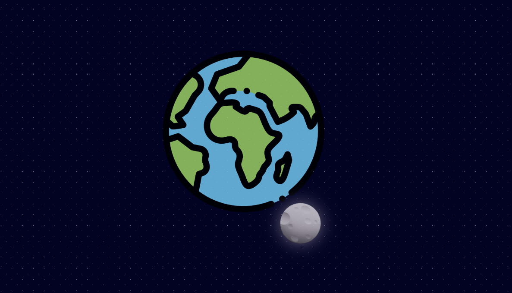

# Earth and Moon Animation

This project demonstrates a simple yet captivating animation of the Moon orbiting around the Earth using HTML and CSS. The animation showcases how to use CSS keyframes and transformations to create a visually appealing effect of celestial bodies in motion.

## Features

- **Earth**: A static image representing the Earth.
- **Moon**: An animated image of the Moon orbiting around the Earth.
- **Responsive Design**: Adapts to different screen sizes, including mobile devices.
- **Custom Styling**: Uses CSS to create a visually appealing background and animation effects.

 ## Preview

### Earth and Moon Animation

Here's a preview of the Earth and Moon animation:

## Files

- `index.html`: The main HTML file that contains the structure of the project.
- `styles.css`: The CSS file for styling the Earth and Moon, including the animation.
- `planet-earth.png`: Image file for the Earth.
- `moon.png`: Image file for the Moon.

